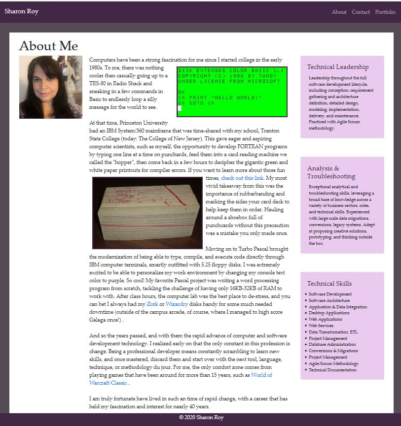
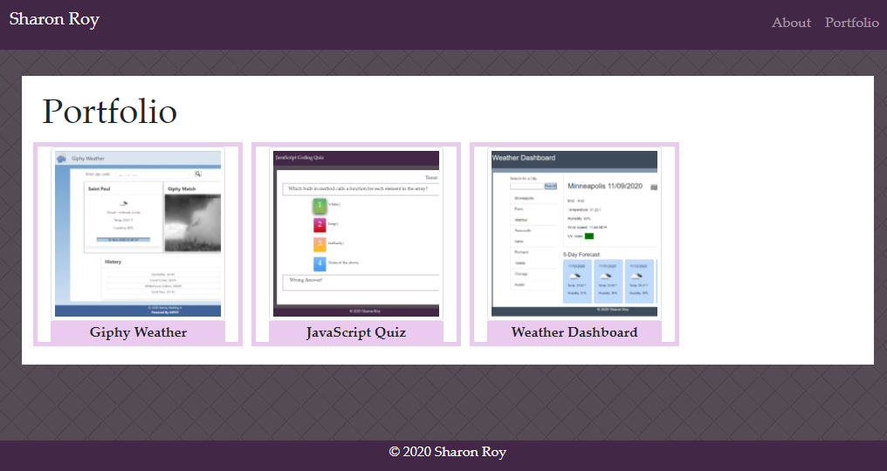

# Sharon Roy Portfolio Web Site

## Description 

Sharon Roy is professional Software Engineer and Developer who has focused work in years past on back-end system and data intergations, services, and desktop applications.
She has more recently been learning to be a JavaScript full-stack web developer by taking the Coding Bootcamp course offered by the University of Minnesota, and has been rapidly adding new skills that are currently in high demand.

The University of Minnesota web coding boot camp offers a challenging curriculum that covers a full-stack:

    HTML5
    CSS3
    JavaScript
    jQuery
    Bootstrap
    Express.js
    React.js
    Node.js
    Database Theory
    MongoDB
    MySQL
    Command Line
    Progressive Web Apps
    Git and more...

## Usage 

This site is published at https://smaryroy.github.io/

## Credits

https://bootcamp.umn.edu/

