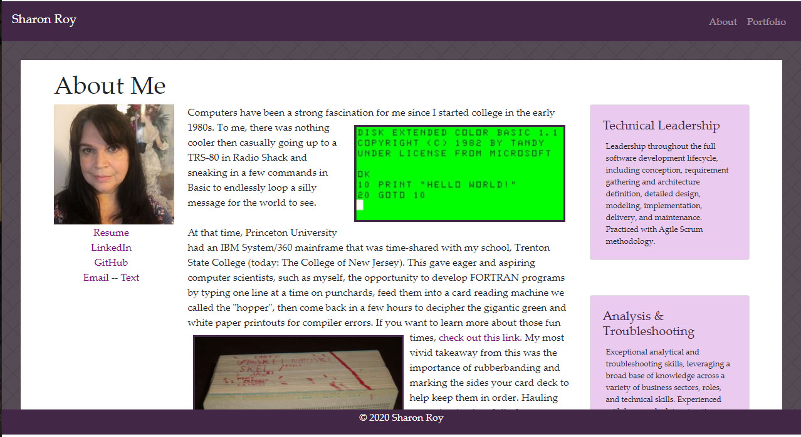

# Sharon Roy Portfolio Web Site

## Description 

Sharon Roy is professional Software Engineer and Developer who has focused work in years past on back-end 
system and data intergations, services, and desktop applications.
She has fallen behind on modern web development tools and technologies, not having 
done much since .Net ASPX pages were popular.

This website is an early prototype of a portfolio website, meant to highlight a few details about Sharon,
 as well as demonstrate skills and projects currently being learned during UoM Coding Bootcamp for Full Stack Web Development. 
It will be modified over time as training progresses.

It is currently made up of three pages:  About, Contact, Portfolio.
The Contact form is incomplete and does not yet post back to a server.
The Portfolio page is incomplete and will be admended over time, right now it only displays placeholders.

Bootstrap has been used to give this site the following:

   * A navbar

   * A responsive layout

   * Responsive images

If done correctly, the website should display across media without major issues.

## Usage 

This site is published at https://smaryroy.github.io/HW2/

## Credits

In according with assignments provided by University of Minnesota Coding Bootcamp.

https://bootcamp.umn.edu/

